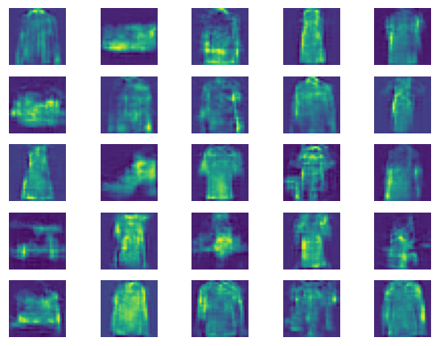

# Generative Adversarial Networks (GANs) Implementation from Scratch with TensorFlow and Keras

## Overview

 **Implementation of Generative Adversarial Networks (GANs)** using TensorFlow and Keras. 

## Core Concept: The GAN Framework

 This project implements the concept of **GANs**, Where two models play a min-max game. The **Generator** generate images and try to convince the discriminator that the data is real. The **Discriminator** tries to distinguish between real or fake images.

### The Generator

The **Generator** is a sequential model with several hidden layers. Its main purpose is to create false images that are difficult to distinguish from reality, in order to test the Discriminator's ability to discern.

### The Discriminator

The Discriminator, on the other hand, plays the role of the evaluator. His role is to distinguish real images and fake generated images .

## The GAN: Merging Generator and Discriminator

The two models then merged using a logical model.  The **Discriminator is marked as not trainable**, only **Generator** weights are updated.

## The Generator Latent Space 

The **Generator** get in input 100 points from the latent space from a normal distribution.

## Results
The model performes well to generate images based on the Fashion_MNIST datasets provided by Keras.  
The results can be improved by providing more training to the model, but that depend on the computational resource available.  

  
